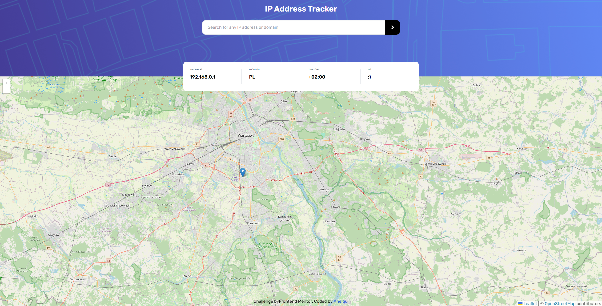

# Frontend Mentor - IP address tracker solution

This is a solution to the [IP address tracker challenge on Frontend Mentor](https://www.frontendmentor.io/challenges/ip-address-tracker-I8-0yYAH0). Frontend Mentor challenges help you improve your coding skills by building realistic projects.

## Table of contents

- [The challenge](#the-challenge)
- [Screenshot](#screenshot)
- [Links](#links)
- [Built with](#built-with)
- [Author](#author)

### The challenge

Users should be able to:

- View the optimal layout for each page depending on their device's screen size
- See hover states for all interactive elements on the page
- See their own IP address on the map on the initial page load
- Search for any IP addresses or domains and see the key information and location

### Screenshot

### Links

- Solution URL: [Link](https://github.com/aneiqu/ip-address-tracker)
- Live Site URL: [Link](https://aneiqu.github.io/ip-address-tracker/)

### Built with

- [React](https://reactjs.org/) - JS library
- [Vite.js](https://vitejs.dev/) - React framework
- [tailwindcss](https://tailwindcss.com/) - For styles
- [leaflet](https://react-leaflet.js.org/) - For map
- [ipify](https://www.ipify.org/) - IP API

## Author

- Frontend Mentor - [@aneiqu](https://www.frontendmentor.io/profile/aneiqu)
